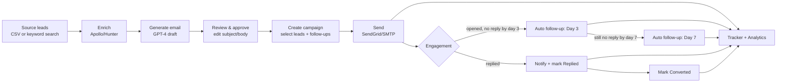

# Software Requirements Specification
## Emberline — AI-Powered Lead Generation and Outreach Automation

**Document status:** Draft v2 for review
**Prepared for:** Engineering, QA, and Product stakeholders

---

### 1. Introduction

#### 1.1 Purpose
This document specifies the functional and non-functional requirements, user roles, system workflows, business rules, and external integrations for Emberline, a single-user outreach automation platform. It is intended to serve as the complete reference for development, QA test-case design, and stakeholder sign-off.

#### 1.2 Intended Audience
Frontend/backend engineers, QA engineers, the product owner, and any reviewer approving scope before backend implementation begins.

#### 1.3 Definitions & Acronyms

| Term | Definition |
|---|---|
| Lead | A prospective business contact sourced via CSV or keyword search |
| Enrichment | The process of augmenting a lead record with contact/firmographic data from a third-party provider |
| Campaign | A named batch of leads sent a generated email (and optional follow-ups) together |
| Draft | An AI-generated email (subject + body) for a specific lead, prior to send |
| Follow-up | An automated second/third-touch email sent on a fixed schedule if a lead has not replied |
| Signal Temperature | The product's name for the lead-engagement scale: contacted → opened → replied → converted |
| SRS | Software Requirements Specification (this document) |
| CAN-SPAM / GDPR | US / EU regulations governing commercial email and personal data processing, respectively |

#### 1.4 Product Summary
Emberline imports or sources leads, enriches them with contact data, drafts a personalized cold email per lead with GPT-4, sends it (with automated follow-ups), and tracks engagement through a CRM-style dashboard.

**Reference demo flow:** user enters "dental clinics in London" → system sources 20 leads with emails → GPT drafts a personalized email per lead → user reviews/approves → emails send → dashboard shows contacted/opened/replied/converted counts → leads who haven't opened by day 3 receive an automated follow-up.

#### 1.5 References
- `frontend-plan.md` — frontend build plan and phase status
- `backend-plan.md` — backend build plan (not yet implemented)

---

### 2. Scope

#### 2.1 In Scope
- Lead input via CSV upload or niche/location keyword search
- Lead enrichment (company, contact name, email, website) via Apollo.io or Hunter.io
- AI-generated personalized cold email per lead (GPT-4, based on company/industry/pain point), with human review/edit/approval before send
- Email sending via SendGrid or SMTP, with a 2-step automated follow-up sequence (day 3, day 7) for non-repliers
- Lead tracker dashboard: contacted, opened, replied, converted
- Reply notifications via Slack or email
- Basic analytics: open rate, reply rate, conversion rate, per-campaign breakdown
- Single-user authentication (login-gated dashboard)
- Minimum viable compliance: sender identity disclosure and opt-out handling on every outbound email (see §6.6, §7)

#### 2.2 Out of Scope (v1)
- Multi-tenant / team accounts and role-based permissions
- Built-in web scraper (v1 relies on third-party enrichment APIs, not custom scraping infra)
- Two-way email inbox / full conversation threading (reply detection only, not a reply UI)
- A/B testing of email copy or send times
- CRM integrations beyond the internal tracker (e.g., HubSpot, Salesforce sync)
- SMS/LinkedIn/multi-channel outreach
- Billing, subscription, or usage metering
- Deliverability/warm-up tooling (dedicated IP warm-up, domain reputation management)
- Advanced analytics (cohort analysis, revenue attribution)
- Full CAN-SPAM/GDPR tooling (e.g., a self-serve data-subject-access-request flow) beyond the minimum opt-out mechanism in §6.6

---

### 3. User Roles and Permissions

Emberline v1 is **single-tenant, single-user** by design (see §2.2). There is one role:

| Role | Description | Permissions |
|---|---|---|
| **Account Owner** | The one authenticated user of the instance | Full access to every feature: lead import/search, enrichment, email generation/edit/approval, campaign creation and send, follow-up configuration, tracker, notifications, analytics, and settings (API keys, sender identity, profile, danger zone). No feature is gated behind a permission check beyond "is logged in." |

**Rules:**
- All routes except `/login` and `/forgot-password` require an authenticated session (§6.1).
- There is no concept of a second user, invited teammate, or viewer/read-only role in v1. Any request for multi-user access is out of scope and would require a follow-on RBAC design (roles such as Admin/Editor/Viewer, per-campaign ownership, and audit logging) that is **not** covered by this document.
- Destructive actions (bulk delete, disconnecting an integration, wiping all data) are available to the Account Owner without a second-approver step, since there is only one user; each still requires an explicit in-app confirmation (§7, BR-9–BR-11).

---

### 4. System Workflows

#### 4.1 End-to-end pipeline

#### 4.2 Lead sourcing workflow
1. User chooses CSV upload or keyword + location search.
2. **CSV path:** user uploads a file → system parses and previews rows, flags missing/malformed columns → user confirms import → valid rows are inserted, duplicates and errors are reported in an import summary.
3. **Search path:** user enters a niche/keyword and a location → system queries the enrichment provider for matching businesses → results stream in as new leads with `pending` enrichment status, importing in the background while the user keeps working elsewhere.

#### 4.3 Enrichment workflow
1. Each newly-sourced lead is queued for enrichment.
2. System calls Apollo.io (primary) or Hunter.io (fallback/alternate) to resolve company, contact name, email, and website.
3. On success, the lead's enrichment status becomes `enriched` and the resolved fields populate the record.
4. On failure (no match, API error, quota exceeded), the status becomes `failed`; the lead remains usable (manually editable) but is excluded from AI generation until re-enriched or manually completed.

#### 4.4 AI email generation & review workflow
1. User triggers generation for a single lead or in bulk for a set of leads.
2. System calls GPT-4 with the lead's company, industry, and detected pain point to produce a subject + body draft.
3. Draft status starts as `draft` (AI-authored, untouched).
4. User may regenerate (discarding the current draft), edit the subject/body (status becomes `edited`), or approve it as-is (status becomes `approved`).
5. A draft in any status may still be sent; approval is a review signal, not a hard gate (see BR-4).

#### 4.5 Campaign creation & send workflow
1. **Step 1 — Select leads:** user names the campaign and selects leads (search/filter available).
2. **Step 2 — Review emails:** user reviews each selected lead's draft status and content; missing drafts can be generated in bulk from this step.
3. **Step 3 — Follow-ups:** user configures the day-3 and day-7 follow-up templates (each independently on/off, with editable subject/body).
4. **Step 4 — Confirm & send:** user chooses immediate or scheduled send, reviews a summary (lead count, approved-draft count, follow-up settings), and confirms. Confirmation is an explicit, irreversible action (BR-8).
5. On confirmation, the campaign is created in `sending` status, leads are assigned to it, and the system transitions the campaign to `active` once dispatch completes.

#### 4.6 Follow-up sequencing workflow
1. For each lead in an active campaign with follow-ups enabled, the system schedules a day-3 and/or day-7 send relative to the initial send time.
2. Immediately before a scheduled follow-up fires, the system checks the lead's current status.
3. If the lead has replied or converted, the follow-up is cancelled (BR-5).
4. If the lead has not engaged, the follow-up sends and the lead's activity timeline records it.

#### 4.7 Reply detection & notification workflow
1. Inbound reply signals (via the email provider's inbound parse / webhook) update the lead's status to `replied`.
2. A notification is created in-app and, if enabled, dispatched to Slack (via incoming webhook) and/or email.
3. The user can mark notifications read individually or in bulk, or clear them; opening a notification tied to a campaign deep-links to that campaign.
4. A lead may be manually marked `converted` once a deal is won; conversion also suppresses any remaining follow-ups (BR-5).

#### 4.8 Analytics aggregation workflow
1. On each analytics view, the system computes open rate, reply rate, and conversion rate from current lead statuses, scoped to any date range filter applied.
2. A trend view buckets historical engagement events (send/open/reply/convert) across the selected window.
3. A per-campaign breakdown table repeats the same rate calculations scoped to each campaign's lead set.

---

### 5. Core Features Summary

| # | Feature | Description |
|---|---------|-------------|
| 1 | Lead Input | CSV upload or keyword+location search to source leads |
| 2 | Enrichment | Fetch company name, contact name, email, website via Apollo.io/Hunter.io API |
| 3 | AI Email Generation | GPT-4 generates a personalized email per lead using company/industry/pain-point context, with human review before send |
| 4 | Campaigns & Sending | Select leads, review emails, configure follow-ups, and send via SendGrid API (or SMTP fallback); track message IDs |
| 5 | Follow-up Sequencing | Auto-send follow-up on day 3 and day 7 if no reply detected; auto-cancel on reply/conversion |
| 6 | Lead Tracker | Status per lead: contacted → opened → replied → converted, with per-lead activity timeline |
| 7 | Reply Detection & Alerts | Detect inbound replies, notify via Slack webhook and/or email, in-app notification center |
| 8 | Analytics Dashboard | Open rate, reply rate, conversion rate (aggregate + per-campaign), with trend view |
| 9 | Settings | API key management, sender identity, profile, and account danger zone |

---

### 6. Functional Requirements

Requirements are written as testable "the system shall" statements, grouped by feature area and identified for traceability (e.g., `FR-AUTH-1`).

#### 6.1 Authentication & Session (`FR-AUTH`)
- **FR-AUTH-1**: The system shall require a valid email/password login before granting access to any page other than sign-in and password-reset.
- **FR-AUTH-2**: The system shall persist an authenticated session across page reloads until the user explicitly signs out.
- **FR-AUTH-3**: The system shall display an inline error on invalid credentials without revealing whether the email or password was incorrect.
- **FR-AUTH-4**: The system shall support a password-reset request flow (request form + confirmation state); actual email delivery of the reset link is out of scope for v1 UI but required at the backend/integration layer.
- **FR-AUTH-5**: On successful login, the system shall redirect to the page the user originally requested (if any), defaulting to the Leads view.
- **FR-AUTH-6**: The system shall disable the sign-in submit control while a login request is in flight and surface a clear error if it fails.

#### 6.2 Lead Input (`FR-LEAD-IN`)
- **FR-LEAD-IN-1**: The system shall accept a CSV file via drag-and-drop or file picker.
- **FR-LEAD-IN-2**: The system shall parse the CSV, display a preview of parsed rows, and identify missing required columns (company, email) and malformed rows before import is confirmed.
- **FR-LEAD-IN-3**: The system shall report an import summary: rows imported, duplicates skipped, and rows in error (with reason per row).
- **FR-LEAD-IN-4**: The system shall accept a free-text niche/keyword and a location string and use them to query the enrichment provider for matching businesses.
- **FR-LEAD-IN-5**: The system shall show a non-blocking progress indicator for keyword-search sourcing, allowing the user to navigate elsewhere while it completes.
- **FR-LEAD-IN-6**: The system shall reject a CSV import or search with a clear, actionable error message if the input is unusable (e.g., not a CSV, empty search fields).

#### 6.3 Lead Enrichment (`FR-ENR`)
- **FR-ENR-1**: The system shall attempt enrichment (company, contact name, email, website) for every lead sourced via keyword search.
- **FR-ENR-2**: The system shall track and display an enrichment status per lead: `pending`, `enriched`, or `failed`.
- **FR-ENR-3**: The system shall retry or allow manual re-trigger of enrichment for leads in `failed` status.
- **FR-ENR-4**: The system shall fall back to a secondary enrichment provider (Hunter.io) if the primary (Apollo.io) does not return a match, where both are configured.

#### 6.4 Leads Management (`FR-LEAD-MGMT`)
- **FR-LEAD-MGMT-1**: The system shall display leads in a paginated, sortable table showing company, contact, email, website, status, and enrichment status.
- **FR-LEAD-MGMT-2**: The system shall support filtering leads by status, industry, campaign, and free-text search (company/contact/email).
- **FR-LEAD-MGMT-3**: The system shall provide a lead detail view with the full enriched profile without losing the underlying table's scroll position or active filters.
- **FR-LEAD-MGMT-4**: The system shall support bulk selection of leads and bulk actions: add to campaign, generate emails, and delete.
- **FR-LEAD-MGMT-5**: The system shall require an explicit confirmation before a bulk delete is executed, and state that the action cannot be undone.
- **FR-LEAD-MGMT-6**: The system shall display an empty state with a call to action when no leads exist, and a distinct empty state when filters produce zero matches.

#### 6.5 AI Email Generation & Review (`FR-GEN`)
- **FR-GEN-1**: The system shall generate a personalized subject and body for a lead using its company, industry, and detected pain point as prompt context.
- **FR-GEN-2**: The system shall support triggering generation for a single lead or in bulk for multiple selected leads.
- **FR-GEN-3**: The system shall display which personalization variables (company, industry, pain point, contact name) were used in a given draft.
- **FR-GEN-4**: The system shall allow the user to edit the subject and body of a generated draft prior to send.
- **FR-GEN-5**: The system shall allow the user to regenerate a draft, replacing its content; if unsaved edits exist, the system shall confirm before discarding them.
- **FR-GEN-6**: The system shall track draft status as `draft` (AI-authored, untouched), `edited` (user-modified), or `approved` (explicitly signed off), and visually distinguish the three.
- **FR-GEN-7**: The system shall show a loading state while generation is in progress and a recoverable error state (with retry) if generation fails.
- **FR-GEN-8**: The system shall provide subject-line length guidance (character count with a recommended-length indicator).

#### 6.6 Campaigns & Outreach (`FR-CAMP`)
- **FR-CAMP-1**: The system shall provide a multi-step campaign creation flow: select leads → review emails → configure follow-ups → confirm & send, with a visible step indicator.
- **FR-CAMP-2**: The system shall allow choosing immediate send or a scheduled future send time.
- **FR-CAMP-3**: The system shall require an explicit, irreversible-action confirmation immediately before dispatching a campaign.
- **FR-CAMP-4**: The system shall list campaigns with their status (`draft`, `sending`, `active`, `completed`), lead count, and creation date.
- **FR-CAMP-5**: The system shall provide a campaign detail view showing per-lead send status within that campaign and the campaign's follow-up configuration.
- **FR-CAMP-6**: The system shall track and expose a message identifier per sent email for delivery/engagement correlation.
- **FR-CAMP-7**: Every outbound email generated by the system shall include the configured sender identity (from name and address) and a functioning unsubscribe/opt-out mechanism, in compliance with CAN-SPAM/GDPR minimum requirements (see BR-12).

> **Note to reviewer:** FR-CAMP-7 (sender disclosure + opt-out) was not present in the original scope list and has been added here because it is a legal minimum for any commercial/cold email product in most jurisdictions (CAN-SPAM in the US, GDPR-adjacent rules in the EU/UK). Please confirm whether this should be tracked as in-scope for v1 or explicitly deferred.

#### 6.7 Follow-up Sequencing (`FR-FOLLOW`)
- **FR-FOLLOW-1**: The system shall support an independent on/off toggle for a day-3 and a day-7 follow-up per campaign.
- **FR-FOLLOW-2**: The system shall allow the subject and body of each follow-up step to be edited before the campaign is sent.
- **FR-FOLLOW-3**: The system shall visualize the follow-up timeline (day 0 / day 3 / day 7) simply and clearly.
- **FR-FOLLOW-4**: The system shall automatically cancel a lead's remaining scheduled follow-ups once that lead replies or is marked converted (BR-5).

#### 6.8 Lead Tracker Dashboard (`FR-TRACK`)
- **FR-TRACK-1**: The system shall display aggregate funnel counts (contacted, opened, replied, converted) with percentage of total, prominently at the top of the tracker view.
- **FR-TRACK-2**: The system shall offer both a kanban-style board (grouped by status) and a status-grouped table view, user-selectable.
- **FR-TRACK-3**: The system shall provide a per-lead activity timeline (sent, opened, replied, follow-up sent, converted) accessible from either view.
- **FR-TRACK-4**: The system shall support quick filtering of the tracker by campaign and by date range.
- **FR-TRACK-5**: The system shall use a consistent color coding for lead status across the tracker, leads table, and analytics views.

#### 6.9 Reply Detection & Notifications (`FR-NOTIF`)
- **FR-NOTIF-1**: The system shall detect inbound replies via the email provider's reply/inbound-parse signal and update the corresponding lead's status to `replied`.
- **FR-NOTIF-2**: The system shall create an in-app notification for each detected reply and for each lead marked converted.
- **FR-NOTIF-3**: The system shall show an unread-count badge on the notification bell.
- **FR-NOTIF-4**: The system shall support marking a single notification read (on open), marking all as read, and clearing all notifications.
- **FR-NOTIF-5**: The system shall support configuring a Slack incoming-webhook URL and an email-alert toggle for reply notifications, with a way to send a test alert and see whether it succeeded.
- **FR-NOTIF-6**: The system shall not send a real Slack/email alert as part of the "send test alert" action to any destination other than the one explicitly configured.

#### 6.10 Analytics Dashboard (`FR-ANALYTICS`)
- **FR-ANALYTICS-1**: The system shall display open rate, reply rate, and conversion rate as headline stats, computed from current lead statuses.
- **FR-ANALYTICS-2**: The system shall display a trend view of engagement over time for the selected date range.
- **FR-ANALYTICS-3**: The system shall provide a per-campaign breakdown table with the same rate metrics scoped to each campaign.
- **FR-ANALYTICS-4**: The system shall support filtering all analytics views by a date range.
- **FR-ANALYTICS-5**: The system shall use consistent status color coding with the tracker and leads views.

#### 6.11 Settings (`FR-SET`)
- **FR-SET-1**: The system shall allow entry and update of API keys for Apollo.io, Hunter.io, OpenAI, and SendGrid, each independently.
- **FR-SET-2**: The system shall mask a saved API key (showing only a short suffix) and shall never redisplay the full key after it has been saved.
- **FR-SET-3**: The system shall provide a reveal/hide toggle for a key while it is being entered (prior to save).
- **FR-SET-4**: The system shall allow configuration of sender identity: from name, from email, and optional SMTP fallback (host, port, username, password) if SendGrid is unavailable.
- **FR-SET-5**: The system shall allow the user to update their account name and email.
- **FR-SET-6**: The system shall provide a "danger zone" allowing the user to disconnect any connected integration independently.
- **FR-SET-7**: The system shall provide a destructive "delete all data" action that requires the user to type a literal confirmation phrase before it becomes available, and shall state plainly what will be deleted.
- **FR-SET-8**: Each settings section shall present its own explicit Save and Cancel actions rather than a single global save.

---

### 7. Business Rules

- **BR-1 (Lead deduplication):** A lead is considered a duplicate of an existing lead if its email address matches an existing lead's email, case-insensitively. Duplicates are skipped on import and counted separately from errors.
- **BR-2 (Status is monotonic by default):** A lead's engagement status only advances forward through contacted → opened → replied → converted as a result of real engagement events; the system does not automatically move a lead backward. Converting a lead is a manual action available at any stage after contact.
- **BR-3 (One draft per lead):** Each lead has at most one active email draft at a time; regenerating replaces the existing draft rather than creating an additional one.
- **BR-4 (Approval is advisory, not a gate):** A campaign may be sent even if some included leads have unapproved (draft/edited) email content; the confirmation screen must clearly disclose how many leads lack an approved draft before the user confirms.
- **BR-5 (Follow-up cancellation):** Any scheduled day-3 or day-7 follow-up for a lead is automatically cancelled the moment that lead's status becomes `replied` or `converted`. A lead never receives a follow-up after it has engaged.
- **BR-6 (Non-openers get day-3 follow-up):** Only leads that have not opened the initial email by the day-3 checkpoint receive the day-3 follow-up (if enabled); leads who opened but did not reply are still eligible per the campaign's configured follow-up rules.
- **BR-7 (Campaign name required):** A campaign cannot advance past lead selection without a non-empty name and at least one selected lead.
- **BR-8 (Irreversible-send confirmation):** Dispatching a campaign (immediate or scheduled) is treated as irreversible once confirmed and requires an explicit confirmation step separate from the "Continue" navigation used elsewhere in the wizard.
- **BR-9 (Bulk delete confirmation):** Bulk-deleting leads requires an explicit confirmation naming the number of leads affected.
- **BR-10 (Disconnect confirmation):** Disconnecting an API integration requires confirmation and immediately invalidates the stored key for that provider.
- **BR-11 (Data-wipe confirmation):** The "delete all data" action is disabled until the user types the exact confirmation phrase, and executes only that single action (no partial/selective deletes from this control).
- **BR-12 (Sender disclosure & opt-out):** Every outbound email must carry the configured sender identity and a working opt-out mechanism; a lead that opts out must be excluded from all current and future sends and follow-ups across every campaign. *(Added per the compliance gap noted at FR-CAMP-7 — recommend the data model add a `do-not-contact` flag on the lead record.)*
- **BR-13 (Single session model):** The system assumes one authenticated user per instance; there is no concept of concurrent multi-user edit conflicts to resolve in v1.

---

### 8. External Integrations

| Integration | Purpose | Direction | Auth | Key data exchanged | Failure handling |
|---|---|---|---|---|---|
| **Apollo.io API** | Primary lead enrichment (company, contact, email, website) | Outbound request / inbound response | API key (stored masked, per §6.11) | Company name, domain, or contact query → enriched contact record | On error/no-match: mark lead `failed`, allow retry or fallback to Hunter.io |
| **Hunter.io API** | Secondary/fallback enrichment, primarily email-finding | Outbound request / inbound response | API key | Domain/name → candidate email + confidence | Same as above; if both providers fail, lead stays enrichable manually |
| **OpenAI GPT-4 API** | Generates personalized cold email drafts | Outbound request / inbound response | API key | Lead context (company, industry, pain point) → subject + body | On error/timeout: show recoverable error with retry; do not silently fall back to a generic template without telling the user |
| **SendGrid API** | Sends campaign emails; provides open/click/reply tracking via webhooks | Outbound send + inbound webhook | API key | Rendered email + recipient → message ID; webhook delivers open/click/bounce/reply events | On send failure: mark that lead's send as failed and surface it in campaign detail; webhooks must be idempotent (safe to receive more than once) |
| **SMTP (fallback)** | Alternate send path if SendGrid is unavailable | Outbound send | Host/port/username/password (password masked) | Rendered email + recipient | Used only if explicitly enabled in Sender Identity settings; failures reported the same way as SendGrid failures |
| **Slack Incoming Webhooks** | Reply/conversion notifications | Outbound only | Webhook URL (masked, user-supplied) | Notification text (lead, campaign, event type) | "Send test alert" must report success/failure distinctly; a malformed URL must fail validation before saving |
| **Nodemailer / email alerts** | Email-based reply/conversion notifications | Outbound only | Uses the configured sender identity / SMTP | Notification content | Toggleable independently of Slack; failures should not block in-app notification creation |

**General integration requirements:**
- All third-party API keys are stored server-side only, never exposed to the client in full.
- All outbound calls to third-party APIs must have a timeout and a bounded retry policy; the UI must not hang indefinitely on a slow provider.
- Webhook endpoints (SendGrid) must verify the request is authentically from the provider before trusting its payload.

---

### 9. Data Model Overview

| Entity | Key fields | Notes |
|---|---|---|
| **Lead** | id, company, contactName, email, website, industry, status, enrichment status, campaignId, painPoint, source (csv/search), createdAt | Status: contacted / opened / replied / converted. Enrichment: pending / enriched / failed. |
| **Campaign** | id, name, status, leadIds, schedule (immediate/scheduled), scheduledAt, followUps (day3/day7 config), createdAt, sentAt | Status: draft / sending / active / completed. |
| **Email Draft** | leadId, subject, body, status, personalization variables, generatedAt, editedAt | Status: draft / edited / approved. One per lead. |
| **Notification** | id, kind (reply/follow_up/conversion), title, detail, leadId, campaignId, createdAt, read | Drives the bell badge and dropdown. |
| **Settings — API Keys** | provider (apollo/hunter/openai/sendgrid), connected, maskedValue, updatedAt | Raw key never returned after save. |
| **Settings — Sender Identity** | fromName, fromEmail, smtpFallbackEnabled, smtpHost, smtpPort, smtpUsername, smtpPassword | SMTP fields only relevant if fallback enabled. |
| **Settings — Profile** | name, email | The single Account Owner's display identity. |

---

### 10. Non-Functional Requirements

#### 10.1 Performance (`NFR-PERF`)
- **NFR-PERF-1**: Core dashboard views (Leads, Tracker, Analytics) shall render initial content within 2 seconds under normal network conditions with up to 10,000 leads.
- **NFR-PERF-2**: Background operations (enrichment, bulk email generation) shall not block the UI thread or prevent navigation to other views.
- **NFR-PERF-3**: List views shall use pagination or virtualization rather than loading an unbounded result set at once.

#### 10.2 Security (`NFR-SEC`)
- **NFR-SEC-1**: All traffic shall be served over HTTPS.
- **NFR-SEC-2**: Authentication tokens shall be stored using secure, industry-standard practice (e.g., httpOnly cookies or equivalent) and expire after a defined period of inactivity.
- **NFR-SEC-3**: All third-party API keys and SMTP credentials shall be encrypted at rest and never logged in plaintext.
- **NFR-SEC-4**: The system shall never return a previously-saved secret (API key, SMTP password) to the client in unmasked form.
- **NFR-SEC-5**: All inbound webhook payloads (SendGrid) shall be signature-verified before being trusted.

#### 10.3 Reliability & Availability (`NFR-REL`)
- **NFR-REL-1**: Scheduled follow-up jobs shall persist durably (e.g., in a durable queue) so they survive an application restart.
- **NFR-REL-2**: A failure calling any single external provider (enrichment, AI generation, email send) shall degrade gracefully — surfacing a clear, retryable error — rather than crashing the page or losing user input.
- **NFR-REL-3**: The system should target no less than 99.5% uptime for the core application during business hours, excluding scheduled maintenance.

#### 10.4 Usability & Accessibility (`NFR-USE`)
- **NFR-USE-1**: The application shall be fully usable via keyboard, with visible focus states on all interactive controls and no keyboard trap outside of intentional modal focus-trapping.
- **NFR-USE-2**: Color shall never be the sole carrier of status meaning; status shall also be conveyed by label text.
- **NFR-USE-3**: Text and interactive elements shall meet WCAG 2.1 AA contrast minimums.
- **NFR-USE-4**: The application shall be responsive down to common mobile viewport widths (≈375px) without loss of functionality or horizontal overflow.
- **NFR-USE-5**: Every list/table view shall present a distinct, actionable empty state (zero-data vs. zero-filter-matches).

#### 10.5 Scalability (`NFR-SCALE`)
- **NFR-SCALE-1**: The data model and job infrastructure shall support at least 10,000 leads and 100 concurrent campaigns per account without requiring architectural changes.
- **NFR-SCALE-2**: The follow-up scheduling mechanism shall scale horizontally (additional worker capacity) without changes to how jobs are enqueued.

#### 10.6 Maintainability (`NFR-MAINT`)
- **NFR-MAINT-1**: The frontend and backend shall share a documented type/contract boundary so a change to a data shape is caught at build time, not runtime.
- **NFR-MAINT-2**: Mock/seed modes used in development shall mirror real API function signatures so swapping in real integrations does not require UI changes.

#### 10.7 Compliance & Data Privacy (`NFR-COMPLY`)
- **NFR-COMPLY-1**: Every outbound marketing/cold email shall include the sender's identity and a functioning opt-out mechanism (CAN-SPAM baseline; see BR-12).
- **NFR-COMPLY-2**: Opt-out requests shall be honored promptly and shall suppress all future sends to that lead across all campaigns.
- **NFR-COMPLY-3**: The "delete all data" control (§6.11) shall provide a practical mechanism for a user to purge stored personal data for their account, supporting basic data-subject deletion expectations under GDPR-style regimes.
- **NFR-COMPLY-4**: Enrichment providers shall only be queried for business/professional contact data consistent with each provider's own terms of service.

#### 10.8 Browser & Device Support (`NFR-COMPAT`)
- **NFR-COMPAT-1**: The application shall support the current and previous major version of Chrome, Firefox, Safari, and Edge.
- **NFR-COMPAT-2**: The application shall support both light-pointer (mouse/trackpad) and touch input for all interactive controls.

---

### 11. Technology Stack

| Layer | Technology |
|-------|-----------|
| Frontend | React (Vite) + Tailwind CSS |
| Backend | Node.js (Express) |
| Database | PostgreSQL |
| Job Queue / Scheduling | BullMQ (Redis-backed) for follow-up scheduling |
| Lead Enrichment | Apollo.io API or Hunter.io API |
| AI Generation | OpenAI GPT-4 API |
| Email Delivery | SendGrid API (webhooks for open/reply tracking) |
| Notifications | Slack Incoming Webhooks / Nodemailer for email alerts |
| Auth | JWT-based auth (Passport.js) or Clerk |
| Hosting | Netlify/Vercel (static frontend) + Railway/Render (API, worker, Redis, Postgres) |
| File Parsing | PapaParse (CSV parsing) |

---

### 12. Development Acceleration Techniques
- **Managed Postgres (Supabase/Neon/Railway)** to skip DB provisioning and ops
- **SendGrid webhooks** for open/click/reply events instead of building custom tracking pixels
- **Official OpenAI Node SDK** for straightforward GPT-4 integration
- **Prebuilt UI kits** (shadcn/ui, Tailwind UI) for dashboard, tables, and forms instead of custom components
- **BullMQ + Upstash Redis** for follow-up scheduling instead of a custom cron/worker system
- **Apollo/Hunter official SDKs or REST clients** instead of hand-rolled scraping
- **Seed/mock mode:** stub enrichment + email APIs during development to iterate on UI/flow without burning API credits
- **npm workspaces monorepo** (client + server in one repo) to keep shared types/config in sync without a heavier framework

---

### 13. Acceptance Criteria (Definition of Done for v1)
The v1 release is considered complete when the reference demo flow (§1.4) can be executed end-to-end against real (non-mock) integrations:
1. A keyword search sources real leads with enriched emails.
2. GPT-4 drafts a personalized email per lead, editable and approvable in the UI.
3. A campaign sends those emails via SendGrid and records a message ID per lead.
4. Opens and replies detected via SendGrid webhooks update the tracker and fire a notification.
5. A lead who hasn't opened by day 3 automatically receives the day-3 follow-up, and it is visible in that lead's activity timeline.
6. Analytics reflects accurate open/reply/conversion rates for the run, both in aggregate and per-campaign.

---

### 14. Open Questions for Reviewer
1. Is the opt-out/CAN-SPAM requirement added in §6.6/§7/§10.7 in scope for v1, or explicitly deferred to a fast-follow release?
2. What is the expected password-reset email delivery mechanism (which provider) — same as SendGrid, or a separate transactional path?
3. Should there be any hard ceiling on send volume per day (e.g., to protect sender reputation) even though dedicated warm-up tooling is out of scope?
4. Confirm the 99.5% uptime and 10,000-lead scale targets in §10 match actual expected usage, or adjust.
